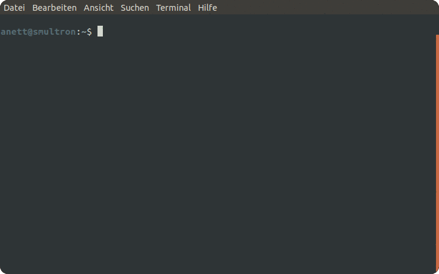

# prompter

`prompter` is a command line tool that helps you choose the next word in a game of [Wordle](https://www.nytimes.com/games/wordle/index.html) - just like a promper in a theater tells the actors what to say next in case they forget.

## Demo



## Install

Archives of precompiled binaries for each [release](https://github.com/noeddl/prompter/releases) of `prompter` are available for Windows, macOS and Linux.

Alternatively, `prompter` can be installed with `cargo`.

```
$ cargo install prompter
```

## Usage

You can use `prompter` in two ways: Either by letting it help you interactively during a game of Wordle or by letting it play by itself simulating how a game with a certain start and target word would have turned out.

### Get help during a Wordle game

```
$ prompter play
```

In each round, `prompter` presents you the 10 best-ranked words and asks you to input the word that you guessed in this round followed by a character code representing the colors shown by Wordle. 

`G` = Green \
`Y` = Yellow \
`_` (underscore) = Gray

See also the demo above.

### Simulate one or several games

```
$ prompter simulate --start <WORD> --target <WORD>
```

This subcommand simulates a game where `--start` is the first word to be guessed and `--target` is the mystery word that `prompter` tries to find. The next word after the start word is chosen by always "guessing" the word to which the algorithm assigns the highest score (words that have the same score are sorted lexicographically).

```
$ prompter simulate --start trace --target today
trace -> today

---[ Round #1 ]------------------------------------------------

2314 candidate words left.
Top candidate word: trace

---[ Round #2 ]------------------------------------------------

21 candidate words left.
Top candidate word: talon

---[ Round #3 ]------------------------------------------------

2 candidate words left.
Top candidate word: today

I won after 3 rounds.
trace -> today: Won after 3 rounds
```

If no `--target` is given, `--start` is tested against all words in the wordlist.

```
$ prompter simulate --start trace
trace -> aback: Won after 3 rounds
trace -> abase: Won after 3 rounds
trace -> abate: Won after 3 rounds
trace -> abbey: Won after 4 rounds
trace -> abbot: Won after 4 rounds
trace -> abhor: Won after 3 rounds
trace -> abide: Won after 3 rounds
...
```

Using this subcommand without any arguments runs the simulation on all combinations of words in the wordlist. This takes several hours to run.

```
$ prompter simulate
With start word "aback", I won 2298 / 2314 games (99.31 %) in on average 3.89 rounds.
With start word "abase", I won 2298 / 2314 games (99.31 %) in on average 3.79 rounds.
With start word "abate", I won 2294 / 2314 games (99.14 %) in on average 3.77 rounds.
With start word "abbey", I won 2291 / 2314 games (99.01 %) in on average 3.89 rounds.
With start word "abbot", I won 2302 / 2314 games (99.48 %) in on average 3.82 rounds.
With start word "abhor", I won 2299 / 2314 games (99.35 %) in on average 3.72 rounds.
With start word "abide", I won 2295 / 2314 games (99.18 %) in on average 3.69 rounds.
...
```

The results of running all simulations can be found in the file [data/results.csv](https://github.com/noeddl/prompter/blob/main/data/results.csv).

## Algorithm

`prompter`'s algorithm follows the simple intuition that a "good" word (or a good sequence of words) should eliminate as many candidates as possible. The idea is to find words that can "split" the wordlist in as many different ways as possible. For each word `w1` in the wordlist, `prompter` computes the color codes that Wordle would assign to each other word `w2` in the wordlist if the player guessed `w1` while `w2` is the mystery word to be found.

|  w1   |  w2   | Code  |
|-------|-------|-------|
| aback | aback | GGGGG |
| aback | abase | GGG\_\_ |
| aback | abate | GGG\_\_ |
| aback | abbey | GG\_\_\_ |
| ...   | ...   | ...   |

The number of color codes that `w1` can elicit is `w1`'s score. Words with high scores are considered to be good words for the next move in the game. This calculation is repeated in each round for the remaining words after Wordle's hints from previous rounds have been applied (i.e. `prompter` is always playing in "hard mode").

## Wordlist

`prompter` uses the [list of Wordle's mystery words](https://docs.google.com/spreadsheets/d/1-M0RIVVZqbeh0mZacdAsJyBrLuEmhKUhNaVAI-7pr2Y/edit#gid=0) (minus the word "slave" which Wordle did not accept as a guess when I tried to use it). The list was provided by Zach Wissner-Gross, author of the column [The Riddler](https://fivethirtyeight.com/features/when-the-riddler-met-wordle/).

## License

Licensed under either of

 * Apache License, Version 2.0
   ([LICENSE-APACHE](LICENSE-APACHE) or http://www.apache.org/licenses/LICENSE-2.0)
 * MIT license
   ([LICENSE-MIT](LICENSE-MIT) or http://opensource.org/licenses/MIT)

at your option.

## Contribution

Unless you explicitly state otherwise, any contribution intentionally submitted
for inclusion in the work by you, as defined in the Apache-2.0 license, shall be
dual licensed as above, without any additional terms or conditions.